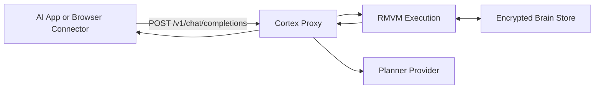

<div align="center">
  
  <h1>Cortex Brain</h1>
  <p><strong>Portable, encrypted memory for your AI chats, behind one stable local endpoint.</strong></p>
  
  <p>
    <a href="https://github.com/vinzify/Cortex-v3.1-RMVM---Relational-Memory-Virtual-Machine/releases"></a>
    <a href="https://rust-lang.org/"></a>
    <a href="https://github.com/vinzify/Cortex-v3.1-RMVM---Relational-Memory-Virtual-Machine/blob/main/LICENSE"></a>
    <a href="https://github.com/vinzify/Cortex-v3.1-RMVM---Relational-Memory-Virtual-Machine/stargazers"></a>
  </p>
</div>

Cortex Brain lets you keep your normal chat workflow while adding **deterministic memory**, audit-proof roots, and safe forget behavior. 🧠✨

> [!IMPORTANT]
> **Experimental:** This project is currently in an experimental state and requires further refinements and testing before it should be considered production-ready.

---

## 🚀 Start Here (30 seconds)

1.  **Install** and run setup. 🛠️
2.  **Start** Cortex with `cortex up`. ⚡
3.  **Use** the printed Base URL and API key in your app settings. 🔑
4.  **Keep chatting** normally. 💬

## ⚠️ Important Before You Start

Cortex has two different keys:

*   **Proxy key** (`ctx_...`): used by your chat app or extension to call local Cortex.
*   **Planner key** (provider API key): used by Cortex to generate memory plans.

Planner key requirements by provider:
- `openai`: requires OpenAI API key (`CORTEX_PLANNER_API_KEY` or `OPENAI_API_KEY`).
- `claude`: requires Anthropic API key.
- `gemini`: requires Google AI API key.
- `ollama`: no cloud API key required. 🏠
- `byo`: you provide plans directly.

> [!NOTE]
> A ChatGPT website subscription is **not** an OpenAI API key.

## ✅ Compatibility

Cortex Brain works with:
- 🌐 OpenAI-compatible clients (Base URL + API key)
- 🧠 OpenAI, Claude, Gemini planners
- 🏠 Ollama local planner
- 🦀 OpenClaw (configured to point to Cortex)
- 🧩 Browser chat surfaces via extension (ChatGPT, Claude, Gemini)

## 🏗️ Architecture



## 🛠️ Quick Start

### 1) Install

**macOS/Linux:**
```bash
curl -fsSL https://raw.githubusercontent.com/vinzify/Cortex-portable-brain/main/install/install.sh | sh
```

**Windows PowerShell:**
```powershell
irm https://github.com/vinzify/Cortex-portable-brain/raw/main/install/install.ps1 | iex
```

### 2) Setup
```bash
cortex setup
```
*For easiest first run without cloud API keys, choose provider `ollama`.* 🏠

### 3) Start
```bash
cortex up
```

## 💬 Choose Your Chat Path

### Path A: OpenAI-compatible app (recommended) 🚀
In your app settings, set:
- **Base URL:** `http://127.0.0.1:8080/v1`
- **API key:** your `ctx_...` key
- **Model:** `cortex-brain`

### Path B: Browser chat websites (ChatGPT/Claude/Gemini) 🧩
Use the extension connector:
- Extension source path: `extension/chrome`
- Load unpacked in Chrome/Edge.

### Path C: ChatGPT subscription only 🏠
1. `cortex provider use ollama`
2. `cortex provider set-model qwen3.5`
3. `cortex up`
4. Use browser extension with your `ctx_...` proxy key.

## 🔍 Verify It Works
```bash
curl -sS -i http://127.0.0.1:8080/v1/chat/completions \
  -H "Authorization: Bearer <your-cortex-proxy-api-key>" \
  -H "Content-Type: application/json" \
  -d "{\"model\":\"cortex-brain\",\"messages\":[{\"role\":\"user\",\"content\":\"remember I prefer tea\"}]}"
```

## 📜 License
**License:** MIT

---
💖 **Support the Project**

If you want to support its continued development, consider sending an ETH donation: 
`0xe7043f731a2f36679a676938e021c6B67F80b9A1`

---
*Cortex Brain - Building the substrate for verifiable intelligence.*
