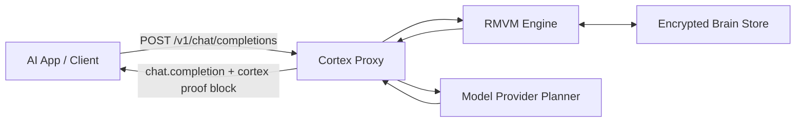
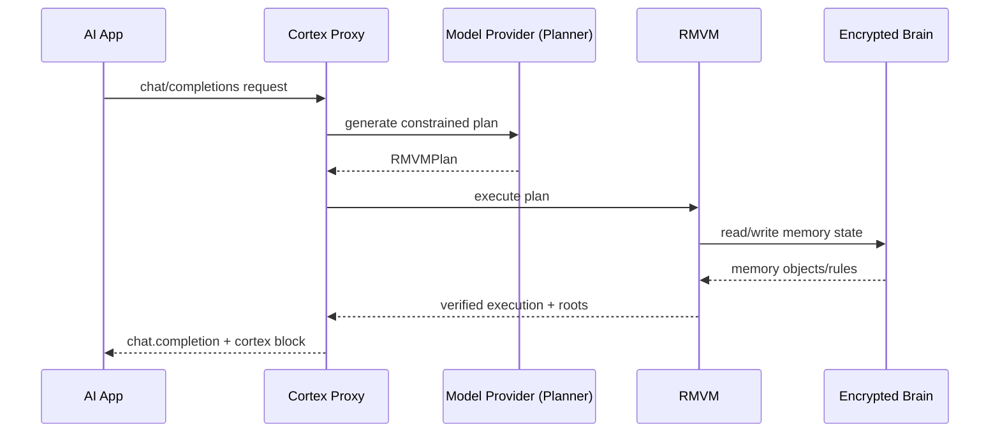

# Cortex Brain


Portable, encrypted memory for AI apps, with one stable local endpoint.

Cortex Brain lets you keep using your normal chat app while memory stays portable, verifiable, and provider-agnostic.

### In 30 seconds
- Run `cortex setup` once.
- Run `cortex up`.
- Paste one Base URL and API key into your AI app.
- Keep chatting normally.

## Table of Contents
- [What Cortex Brain Is](#what-cortex-brain-is)
- [Compatibility](#compatibility)
- [Why Cortex Is Different](#why-cortex-is-different)
- [Architecture](#architecture)
- [Quick Start (3 Steps)](#quick-start-3-steps)
- [See If Cortex Is Running](#see-if-cortex-is-running)
- [Where To Paste Base URL and API Key](#where-to-paste-base-url-and-api-key)
- [Using Ollama (Important)](#using-ollama-important)
- [Daily Use (No CLI Needed)](#daily-use-no-cli-needed)
- [Switch Provider in 10 Seconds](#switch-provider-in-10-seconds)
- [How to Verify It Works](#how-to-verify-it-works)
- [Complete Use Case](#complete-use-case)
- [Brain Management](#brain-management)
- [Runtime Controls](#runtime-controls)
- [Troubleshooting](#troubleshooting)
- [Docs](#docs)
- [What Cortex Brain Includes](#what-cortex-brain-includes)
- [Advanced Reference](#advanced-reference)

## What Cortex Brain Is
Cortex Brain is a local proxy + encrypted brain store.

- Your AI app talks to Cortex using OpenAI-compatible chat completions.
- Cortex plans and executes memory operations deterministically via RMVM.
- Cortex returns normal chat output plus a `cortex` block with verification roots.

Short definitions:
- RMVM: the deterministic memory execution engine behind Cortex.
- `semantic_root`: a stable proof hash for the semantic outcome of execution.
- `trace_root`: a proof hash for the execution trace.

## Compatibility
Cortex Brain works with:
- OpenAI
- Claude (via OpenAI-compatible endpoint)
- Gemini (via OpenAI-compatible endpoint)
- Ollama (local)
- OpenClaw (by pointing its Base URL to Cortex)
- Any tool that supports OpenAI-compatible chat completions

Scope:
- Supported: OpenAI-compatible `POST /v1/chat/completions`
- Not supported: full OpenAI API surface

## Why Cortex Is Different
Typical memory systems are retrieval-only:
- Store text chunks
- Retrieve top-k similar chunks
- Ask model to infer from retrieved text
- Results can vary and be hard to audit

Cortex is execution-based:
- A constrained plan is produced
- RMVM executes that plan deterministically
- Output is returned from verified execution
- Proof roots are included for auditing

Concrete guarantees:
- No memory claim without evidence (verified assertions only)
- Deterministic behavior (`semantic_root` stability for same inputs)
- Safe forget behavior (deterministic suppression, not silent deletion)

## Architecture



## Request Lifecycle



## Quick Start (3 Steps)

### 1) Install (No Rust Required)

macOS/Linux:
```bash
curl -fsSL https://raw.githubusercontent.com/vinzify/Cortex-portable-brain/main/install/install.sh | sh
```

Windows PowerShell:
```powershell
irm https://github.com/vinzify/Cortex-portable-brain/raw/main/install/install.ps1 | iex
```

If your network blocks raw script fetch, use:
```powershell
git clone https://github.com/vinzify/Cortex-portable-brain.git
powershell -NoProfile -ExecutionPolicy Bypass -File .\Cortex-portable-brain\install\install.ps1
```

Docker:
```bash
docker run --rm -p 8080:8080 ghcr.io/vinzify/cortex-portable-brain:latest
```

### 2) Run guided setup

```bash
cortex setup
```

This creates/selects your brain and maps your proxy API key.

### 3) Start everything

```bash
cortex up
```

`cortex up` starts:
- RMVM gRPC runtime (managed sidecar by default)
- Cortex proxy on `http://127.0.0.1:8080`

You will see a copy/paste block:
```bash
Copy/paste client settings:
Base URL: http://127.0.0.1:8080/v1
API Key: ctx_...
Provider: OpenAI (gpt-4o-mini)
Brain: personal
```

Show it anytime:
```bash
cortex status --copy
```

## See If Cortex Is Running

Use any of these:
```bash
cortex status --verbose
cortex open --url
cortex open
```

`cortex up` also prints a dashboard URL. Open it in your browser to confirm:
- proxy endpoint
- provider/model
- RMVM health
- copy/paste settings

## Where To Paste Base URL and API Key

Paste values in your AI app provider/model settings:
- Base URL: `http://127.0.0.1:8080/v1`
- API key: your Cortex key (`ctx_...`)
- Model: `cortex-brain`

Do not paste these values inside the chat message itself.

## Using Ollama (Important)

Ollama is the model backend. Cortex is the memory proxy endpoint.

- If you use an OpenAI-compatible chat client, set Base URL/API key there and keep chatting.
- `ollama serve` must be running for local Ollama models.
- `ollama run ...` is direct Ollama chat and does not use Cortex Base URL settings.

So for Cortex memory, use a client that supports custom OpenAI-compatible Base URL + API key.

## Daily Use (No CLI Needed)
After setup:
- Chat as usual in your existing app.
- Cortex handles memory write/recall behind the proxy.
- Use CLI only for admin actions: switch provider, export/import, forget, doctor.

## Switch Provider in 10 Seconds

Switch from OpenAI to Claude:
```bash
cortex provider use claude
```

Optional model change:
```bash
cortex provider set-model claude-opus-4-6
```

Your app settings stay the same:
- Same Base URL
- Same API key

Supported profiles:
- `openai`
- `claude`
- `gemini`
- `ollama`
- `byo`

## How to Verify It Works

### Smoke test
```bash
curl -sS -i http://127.0.0.1:8080/v1/chat/completions \
  -H "Authorization: Bearer <your-cortex-proxy-api-key>" \
  -H "Content-Type: application/json" \
  -d "{\"model\":\"cortex-brain\",\"messages\":[{\"role\":\"user\",\"content\":\"remember I prefer tea\"}]}"
```

Expected:
- `HTTP/1.1 200 OK`
- `chat.completion` response
- `cortex` block present

If `STALL` or `REJECTED`:
```bash
cortex doctor
```

### Trust test (determinism check)
Run the same request twice:

```bash
curl -sS http://127.0.0.1:8080/v1/chat/completions \
  -H "Authorization: Bearer <your-cortex-proxy-api-key>" \
  -H "Content-Type: application/json" \
  -d "{\"model\":\"cortex-brain\",\"messages\":[{\"role\":\"user\",\"content\":\"remember I prefer tea\"}]}" > resp1.json

curl -sS http://127.0.0.1:8080/v1/chat/completions \
  -H "Authorization: Bearer <your-cortex-proxy-api-key>" \
  -H "Content-Type: application/json" \
  -d "{\"model\":\"cortex-brain\",\"messages\":[{\"role\":\"user\",\"content\":\"remember I prefer tea\"}]}" > resp2.json
```

Check `cortex.semantic_root` in both.  
For same inputs, it should match.

## Complete Use Case

This is an API-level verification flow.  
In normal use, the same behavior happens through your chat UI.

### 1) Write memory
```bash
curl -sS http://127.0.0.1:8080/v1/chat/completions \
  -H "Authorization: Bearer <your-cortex-proxy-api-key>" \
  -H "Content-Type: application/json" \
  -d "{\"model\":\"cortex-brain\",\"messages\":[{\"role\":\"user\",\"content\":\"My preferred drink is tea. Remember this.\"}]}"
```

### 2) Query memory
```bash
curl -sS http://127.0.0.1:8080/v1/chat/completions \
  -H "Authorization: Bearer <your-cortex-proxy-api-key>" \
  -H "Content-Type: application/json" \
  -d "{\"model\":\"cortex-brain\",\"messages\":[{\"role\":\"user\",\"content\":\"What drink do I prefer?\"}]}"
```

Expected:
- Answer references remembered preference
- Response includes `cortex.semantic_root` and `cortex.trace_root`

### 3) Switch provider, keep same endpoint
```bash
cortex provider use claude
```

Optional:
```bash
cortex provider set-model claude-opus-4-6
```

Repeat the same query call.  
Base URL and API key do not change.

### 4) Forget (suppression)
```bash
cortex brain forget --subject user:local --predicate prefers_beverage --reason "suppress preference"
```

Query again:
```bash
curl -sS http://127.0.0.1:8080/v1/chat/completions \
  -H "Authorization: Bearer <your-cortex-proxy-api-key>" \
  -H "Content-Type: application/json" \
  -d "{\"model\":\"cortex-brain\",\"messages\":[{\"role\":\"user\",\"content\":\"What drink do I prefer?\"}]}"
```

Expected:
- Previous preference is suppressed by deterministic forget rules

## Brain Management

Show current brain:
```bash
cortex brain current
```

List and switch:
```bash
cortex brain list
cortex brain use <brain-id-or-name>
```

Export and import:
```bash
cortex brain export <brain-id-or-name> --out personal.cbrain
cortex brain import --in personal.cbrain --name personal
```

Forget (suppression):
```bash
cortex brain forget --subject user:local --predicate prefers_beverage --reason "suppress preference"
```

## Runtime Controls

Start:
```bash
cortex up
```

Stop:
```bash
cortex stop --all
```

Status:
```bash
cortex status --verbose
cortex status --copy
cortex open
```

Logs:
```bash
cortex logs --service all --tail 200 --follow
```

## Troubleshooting

```bash
cortex doctor
```

If needed:
```bash
cortex logs --service all --tail 200 --follow
```

More fixes:
- `docs/common_problems.md`

## Docs

Getting started:
- `docs/getting_started.md`
- `docs/common_problems.md`
- `docs/dashboard.md`

Provider guides:
- OpenAI planner: `docs/providers/openai.md`
- Claude planner: `docs/providers/claude.md`
- Gemini planner: `docs/providers/gemini.md`
- Ollama planner: `docs/providers/ollama.md`
- OpenClaw integration: `docs/providers/openclaw.md`

Operations and security:
- `docs/operations/server_config.md`
- `docs/operations/baseline_update_policy.md`
- `docs/security/controls.md`
- `docs/security_model.md`
- `docs/proxy_mode.md`
- `docs/portable_brain_format.md`
- `docs/forget_ux.md`
- `docs/use_cases.md`

Compatibility:
- `core_version.lock`
- `docs/compatibility_matrix.md`

Migration:
- `docs/migration_from_cortex_rmvm.md`

## What Cortex Brain Includes

- `cortex` CLI (`setup`, `up`, `stop`, `status`, `logs`, `provider`, `brain`, `auth`, `doctor`)
- Encrypted local brain store with export/import
- OpenAI-compatible `POST /v1/chat/completions` proxy
- Planner modes: `openai`, `byo`, `fallback`
- Managed RMVM sidecar runtime by default

## Advanced Reference

### Full CLI Surface

```bash
cortex setup [--non-interactive] [--provider <name>] [--model <model>] [--brain <name>] [--api-key <key>] [--rmvm-endpoint <grpc-url>]
cortex up [--provider <name>] [--brain <name>] [--proxy-addr <host:port>] [--rmvm-endpoint <grpc-url>] [--rmvm-port <port>]
cortex stop [--all|--proxy-only|--rmvm-only] [--force]
cortex status [--json] [--verbose] [--copy]
cortex logs [--service proxy|rmvm|all] [--tail <n>] [--follow]

cortex provider list [--json]
cortex provider use <name> [--model <model>] [--restart auto|never]
cortex provider set-model <model> [--provider <name>] [--restart auto|never]

cortex brain create <name> [--tenant <id>] [--passphrase-env <ENV>]
cortex brain current [--json]
cortex brain use <brain-id-or-name>
cortex brain list [--json]
cortex brain export <brain-id-or-name> --out <file.cbrain>
cortex brain import --in <file.cbrain> [--name <alias>] [--verify-only]
cortex brain branch <brain-id-or-name> --new <branch-name>
cortex brain merge --source <branch> --target <branch> [--strategy ours|theirs|manual] [--brain <id>]
cortex brain forget --subject <subject> --predicate <predicate> [--scope <scope>] [--reason <text>] [--brain <id>]
cortex brain attach --agent <id> --model <id> --read <csv> --write <csv> --sinks <csv> [--ttl <duration>] [--brain <id>]
cortex brain detach --agent <id> [--model <id>] [--brain <id>]
cortex brain audit [--since <iso>] [--until <iso>] [--subject <subject>] [--json] [--brain <id>]

cortex auth map-key --api-key <key> --tenant <tenant> --brain <brain-id> [--subject <subject>]
cortex doctor [--proxy-base-url <url>] [--endpoint <grpc-url>] [--brain <id>] [--planner-mode openai|byo|fallback]
cortex open [--print-only] [--url]
```

### Environment Variables

- `CORTEX_BRAIN`
- `CORTEX_ENDPOINT`
- `CORTEX_BRAIN_SECRET`
- `CORTEX_PLANNER_MODE`
- `CORTEX_PLANNER_BASE_URL`
- `CORTEX_PLANNER_MODEL`
- `CORTEX_PLANNER_API_KEY`
- `OPENAI_BASE_URL`
- `OPENAI_API_KEY`
- `RMVM_SERVER_ADDR`
- `RMVM_MAX_DECODING_BYTES`
- `RMVM_MAX_ENCODING_BYTES`
- `RMVM_REQUEST_TIMEOUT_SECS`

### Developer Build

```bash
cargo test --locked
cargo run -p cortex-app -- setup --non-interactive --provider ollama --brain demo --api-key ctx_demo_key
cargo run -p cortex-app -- up
```

