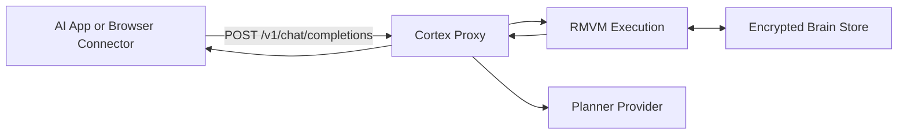

# Cortex Brain


Portable, encrypted memory for your AI chats, behind one stable local endpoint.

Cortex Brain lets you keep your normal chat workflow while adding deterministic memory, audit proof roots, and safe forget behavior.

## Start Here (30 seconds)

1. Install and run setup.
2. Start Cortex with `cortex up`.
3. Use the printed Base URL and API key in your app settings.
4. Keep chatting normally.

## Important Before You Start

Cortex has two different keys:

- Proxy key (`ctx_...`): used by your chat app or extension to call local Cortex.
- Planner key (provider API key): used by Cortex to generate memory plans.

Planner key requirements by provider:

- `openai`: requires OpenAI API key (`CORTEX_PLANNER_API_KEY` or `OPENAI_API_KEY`).
- `claude`: requires Anthropic API key.
- `gemini`: requires Google AI API key.
- `ollama`: no cloud API key required.
- `byo`: you provide plans directly.

Important: a ChatGPT website subscription is not an OpenAI API key.

## Compatibility

Cortex Brain works with:

- OpenAI-compatible clients (Base URL + API key)
- OpenAI, Claude, Gemini planners (via OpenAI-compatible planner endpoints)
- Ollama local planner
- OpenClaw (configured to point to Cortex)
- Browser chat surfaces via extension (ChatGPT, Claude, Gemini)

API scope:

- Supported: `POST /v1/chat/completions`
- Not supported: full OpenAI API surface

## Why Cortex Is Different

Typical memory is retrieval-only (vector search + best-effort generation).

Cortex is execution-based:

- Model generates constrained plan
- RMVM executes deterministically
- Output is derived from verified assertions
- Proof roots are returned (`semantic_root`, `trace_root`)

Concrete guarantees:

- No memory claim without evidence
- Stable behavior for same inputs (`semantic_root` stability)
- Deterministic forget suppression (not silent deletion)

## Architecture



## Quick Start

### 1) Install

macOS/Linux:
```bash
curl -fsSL https://raw.githubusercontent.com/vinzify/Cortex-portable-brain/main/install/install.sh | sh
```

Windows PowerShell:
```powershell
irm https://github.com/vinzify/Cortex-portable-brain/raw/main/install/install.ps1 | iex
```

If your network blocks raw script fetch:
```powershell
git clone https://github.com/vinzify/Cortex-portable-brain.git
powershell -NoProfile -ExecutionPolicy Bypass -File .\Cortex-portable-brain\install\install.ps1
```

### 2) Setup

```bash
cortex setup
```

For easiest first run without cloud API keys, choose provider `ollama`.

### 3) Start

```bash
cortex up
```

You will get copy/paste settings:

```text
Base URL: http://127.0.0.1:8080/v1
API Key: ctx_...
Provider: ...
Brain: personal
```

Show again anytime:

```bash
cortex status --copy
```

## Choose Your Chat Path

### Path A: OpenAI-compatible app (recommended)

In your app settings (not chat text), set:

- Base URL: `http://127.0.0.1:8080/v1`
- API key: your `ctx_...` key
- Model: `cortex-brain`

Then chat normally.

### Path B: Browser chat websites (ChatGPT/Claude/Gemini)

Use the extension connector:

- Extension source path: `extension/chrome`
- Load unpacked in Chrome/Edge
- Set Base URL/API key/model in popup
- If you installed only binaries, clone this repo to access `extension/chrome`

Guide:
- `docs/connectors/browser_extension.md`

### Path C: ChatGPT subscription only (no OpenAI API key)

If you only have ChatGPT web subscription, use:

1. `cortex provider use ollama`
2. `cortex provider set-model qwen3.5`
3. `cortex stop --all`
4. `cortex up`
5. Use browser extension with your `ctx_...` proxy key

This avoids cloud planner keys while still giving Cortex memory on browser chats.

## Provider Switching (same app settings)

Switch planner provider:

```bash
cortex provider use claude
cortex provider set-model claude-opus-4-6
```

Your app keeps the same Base URL and proxy API key.

## Verify It Works

```bash
curl -sS -i http://127.0.0.1:8080/v1/chat/completions \
  -H "Authorization: Bearer <your-cortex-proxy-api-key>" \
  -H "Content-Type: application/json" \
  -d "{\"model\":\"cortex-brain\",\"messages\":[{\"role\":\"user\",\"content\":\"remember I prefer tea\"}]}"
```

Expected:

- `HTTP/1.1 200 OK`
- `chat.completion` response
- `cortex` block present

## First-Run Errors and Exact Fixes

If you see:
`Error: openai planner mode requires CORTEX_PLANNER_API_KEY or OPENAI_API_KEY`

Fix:

```powershell
$env:CORTEX_PLANNER_API_KEY="sk-..."
cortex stop --all
cortex up
```

If you see:
`Error: API key is not mapped`

Fix:

```bash
cortex brain current
cortex auth map-key --api-key <ctx_key> --tenant local --brain <brain_id> --subject user:local
```

If `STALL` or `REJECTED` appears:

```bash
cortex doctor
cortex logs --service all --tail 200 --follow
```

## Daily Commands

```bash
cortex connect
cortex connect status
cortex mode set auto
cortex mode status

cortex brain current
cortex brain list
cortex brain use <brain-id-or-name>
cortex brain export <brain-id-or-name> --out personal.cbrain
cortex brain import --in personal.cbrain --name personal
cortex brain forget --subject user:local --predicate prefers_beverage --reason "suppress preference"

cortex status --verbose
cortex open
cortex logs --service all --tail 200 --follow
```

## Stop and Uninstall

```bash
cortex stop --all
cortex uninstall
cortex uninstall --all --yes
```

`cortex uninstall --all --yes` removes local data and installed Cortex binaries.

## Docs

Getting started:

- `docs/getting_started.md`
- `docs/common_problems.md`
- `docs/dashboard.md`
- `docs/connectors/browser_extension.md`

Provider recipes:

- `docs/providers/openai.md`
- `docs/providers/claude.md`
- `docs/providers/gemini.md`
- `docs/providers/ollama.md`
- `docs/providers/openclaw.md`

Operations and security:

- `docs/operations/server_config.md`
- `docs/operations/baseline_update_policy.md`
- `docs/security/controls.md`
- `docs/security_model.md`
- `docs/proxy_mode.md`
- `docs/portable_brain_format.md`
- `docs/forget_ux.md`
- `docs/use_cases.md`

Compatibility:

- `core_version.lock`
- `docs/compatibility_matrix.md`

Migration:

- `docs/migration_from_cortex_rmvm.md`

## Advanced CLI Reference

```bash
cortex setup [--non-interactive] [--provider <name>] [--model <model>] [--brain <name>] [--api-key <key>] [--rmvm-endpoint <grpc-url>]
cortex connect [--non-interactive]
cortex connect status [--json]
cortex connect enable <name>
cortex connect disable <name>
cortex mode set <auto|confirm|private>
cortex mode status [--json]
cortex up [--provider <name>] [--brain <name>] [--proxy-addr <host:port>] [--rmvm-endpoint <grpc-url>] [--rmvm-port <port>]
cortex stop [--all|--proxy-only|--rmvm-only] [--force]
cortex uninstall [--all] [--yes]
cortex status [--json] [--verbose] [--copy]
cortex logs [--service proxy|rmvm|all] [--tail <n>] [--follow]

cortex provider list [--json]
cortex provider use <name> [--model <model>] [--restart auto|never]
cortex provider set-model <model> [--provider <name>] [--restart auto|never]

cortex brain create <name> [--tenant <id>] [--passphrase-env <ENV>]
cortex brain current [--json]
cortex brain use <brain-id-or-name>
cortex brain list [--json]
cortex brain export <brain-id-or-name> --out <file.cbrain>
cortex brain import --in <file.cbrain> [--name <alias>] [--verify-only]
cortex brain branch <brain-id-or-name> --new <branch-name>
cortex brain merge --source <branch> --target <branch> [--strategy ours|theirs|manual] [--brain <id>]
cortex brain forget --subject <subject> --predicate <predicate> [--scope <scope>] [--reason <text>] [--brain <id>]
cortex brain attach --agent <id> --model <id> --read <csv> --write <csv> --sinks <csv> [--ttl <duration>] [--brain <id>]
cortex brain detach --agent <id> [--model <id>] [--brain <id>]
cortex brain audit [--since <iso>] [--until <iso>] [--subject <subject>] [--json] [--brain <id>]

cortex auth map-key --api-key <key> --tenant <tenant> --brain <brain-id> [--subject <subject>]
cortex doctor [--proxy-base-url <url>] [--endpoint <grpc-url>] [--brain <id>] [--planner-mode openai|byo|fallback]
cortex open [--print-only] [--url]
```

## Environment Variables

- `CORTEX_BRAIN`
- `CORTEX_ENDPOINT`
- `CORTEX_BRAIN_SECRET`
- `CORTEX_PLANNER_MODE`
- `CORTEX_PLANNER_BASE_URL`
- `CORTEX_PLANNER_MODEL`
- `CORTEX_PLANNER_API_KEY`
- `OPENAI_BASE_URL`
- `OPENAI_API_KEY`
- `RMVM_SERVER_ADDR`
- `RMVM_MAX_DECODING_BYTES`
- `RMVM_MAX_ENCODING_BYTES`
- `RMVM_REQUEST_TIMEOUT_SECS`

## Developer Build

```bash
cargo test --locked
cargo run -p cortex-app -- setup --non-interactive --provider ollama --brain demo --api-key ctx_demo_key
cargo run -p cortex-app -- up
```
